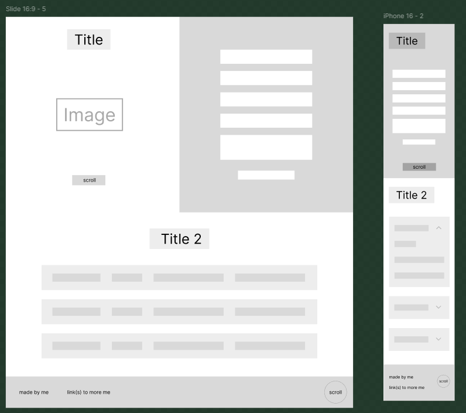

# My SQL Code

```sql
CREATE TABLE IF NOT EXISTS entries(
  id int primary key generated always as identity,
  name text not null,
  message text not null,
  date_written text not null
)

--dummy data
INSERT INTO entries (name, message, date_written) VALUES ('Jim Carrey', 'Eggstatic coffee!', '25/5/2025 21:03');
INSERT INTO entries (name, message, date_written) VALUES ('Luigi Mario', 'Yippeeee', '21/5/2025 00:00');
INSERT INTO entries (name, message, date_written) VALUES ('Mario Mario', 'Wahooo!', '25/5/2025 10:04');
INSERT INTO entries (name, message, date_written) VALUES ('Jim Carrey', 'Eeeeeeeeeeeeeeeeeeeeeeeeeeeeeeeeeeeeeggstatic coffee!', '25/5/2025 23:12');
```

# My Wireframes



# My Reflection

## What Went Well

I believe that the majority of my project has become a success. I say this because I have calmly executed the requirements laid out for me, as well as the goals I personally wanted to achieve—such as creating a nice design.

Some of the simpler features are included to add only a boost to fucntionality and/or UX, however, I am proud that I managed to achieve them flawlessly (to my knowledge), especially for the ones I have not achieved before. These would include:

- Elequant text wrapping (via `flex-wrap` and `overflow-wrap`)
- GET and POST requests using `fetch()` and express
- A mobile friendly design
- DOM manipulation (mainly element creation)

There are some things that differ between my final product and my wireframes, but I believe these are all justified for the following reasons:

- Titles now centred on mobile — more in line and continuous with the other elements
- Collapsable messages — text was concise enough no matter the length

## Ways to Improve

I could improve this site and my skills by through the following:

- Using git branches to separate my processes and allow more room for error
- Adding a delete button for your messages so they are not permanent
- Adding accessibility features
- Directly catering towards more resolutions
- Using a method other than `position: absolute;` to position the `#heroText` on mobile
